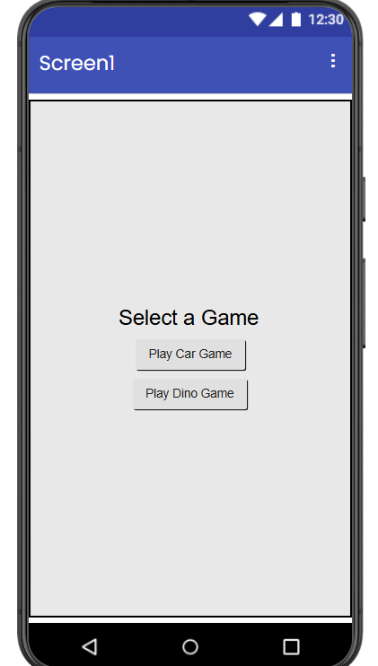
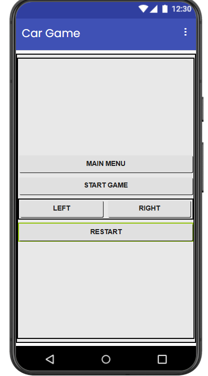
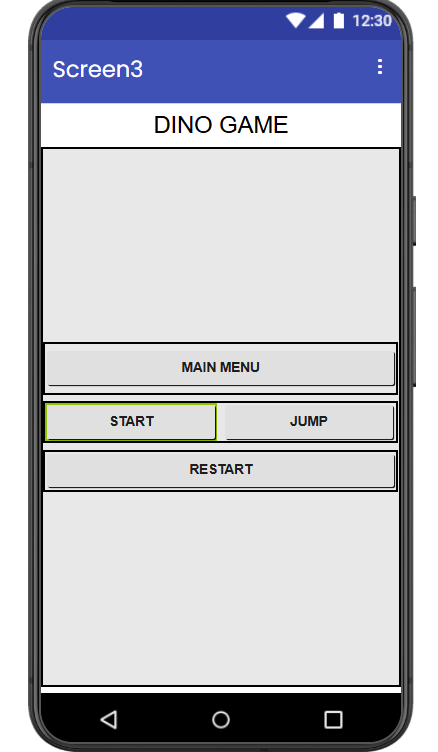

# 🚗🎮 Dual Game Console using NodeMCU, OLED & MIT App Inventor

<div align="center">


### 📱 Wireless OLED Gaming Console Controlled by Android App

**A dual-game embedded system featuring Car Racing and Dino Runner games controlled wirelessly using a custom Android application built with MIT App Inventor.**

</div>

---

# 📖 Overview

This project is a **wireless gaming console** developed using **NodeMCU ESP8266**, a **128×64 SSD1306 OLED Display**, and an **Android application built using MIT App Inventor**.

The NodeMCU hosts its own Wi-Fi Access Point and runs an HTTP server. The Android application sends control commands over Wi-Fi, allowing users to play two different games displayed on the OLED screen.

## 🎮 Included Games

- 🚗 Car Racing Game
- 🦖 Dino Runner Game

---

# ✨ Features

- 🎮 Two games in one project
- 📱 Android Controller using MIT App Inventor
- 📶 Wireless communication using Wi-Fi
- 📺 OLED Graphics
- 🚗 Smooth Car Racing Gameplay
- 🦖 Endless Dino Runner
- 🏆 High Score System
- 🔄 Restart Feature
- 📡 ESP8266 Web Server
- ⚡ Real-Time Controls
- 📱 User-Friendly Interface

---

# 🛠 Hardware Requirements

| Component | Quantity |
|-----------|----------|
| NodeMCU ESP8266 | 1 |
| SSD1306 OLED Display (128×64 I2C) | 1 |
| Breadboard | 1 |
| Jumper Wires | As Required |
| USB Cable | 1 |
| Android Phone | 1 |

---

# 💻 Software Requirements

- Arduino IDE
- MIT App Inventor
- ESP8266 Board Package
- Adafruit SSD1306 Library
- Adafruit GFX Library
- ESP8266WiFi Library
- ESP8266WebServer Library

---

# 📚 Arduino Libraries

```cpp
#include <Wire.h>
#include <Adafruit_GFX.h>
#include <Adafruit_SSD1306.h>
#include <ESP8266WiFi.h>
#include <ESP8266WebServer.h>
```

---

# 📡 Wi-Fi Configuration

The NodeMCU creates its own Wi-Fi hotspot.

```
SSID     : CAR_GAME
Password : 12345678
```

Connect your Android phone to this Wi-Fi before opening the application.

---

# 📱 Android Application

The Android application is completely developed using **MIT App Inventor**.

### Features

- Home Screen
- Car Game Screen
- Dino Game Screen
- HTTP Communication
- Wireless Controls
- Restart Game
- Main Menu Navigation

---

# 🏠 Home Screen

Users can choose between two games.

```
+-----------------------+
|     Select a Game     |
|                       |
|   Play Car Game       |
|                       |
|   Play Dino Game      |
+-----------------------+
```

---

# 🚗 Car Game

## Controls

| Button | Function |
|---------|----------|
| Start Game | Start the game |
| Left | Move Left |
| Right | Move Right |
| Restart | Restart Game |
| Main Menu | Return Home |

---

## Gameplay

- Two lane road
- Enemy cars
- Collision Detection
- Score Counter
- High Score
- Endless Gameplay

---

# 🦖 Dino Game

## Controls

| Button | Function |
|---------|----------|
| Start | Start Game |
| Jump | Jump |
| Restart | Restart Game |
| Main Menu | Return Home |

---

## Gameplay

- Endless Runner
- Jump Physics
- Gravity Simulation
- Cactus Obstacles
- Collision Detection
- High Score

---

# 🌐 HTTP API

The Android application communicates using HTTP GET requests.

| Endpoint | Description |
|----------|-------------|
| `/screen_car` | Open Car Game |
| `/screen_dino` | Open Dino Game |
| `/play_car` | Start Car Game |
| `/play_dino` | Start Dino Game |
| `/left` | Move Left |
| `/right` | Move Right |
| `/jump` | Jump |
| `/menu` | Return Main Menu |

---

# 🔄 Working Flow

```
                Android Phone
                       │
                       │
                HTTP Requests
                       │
                       ▼
             NodeMCU ESP8266
                       │
               ESP8266 Web Server
                       │
              Game Logic Execution
                       │
                OLED Display Output
```

---

# 📂 Folder Structure

```
Dual-Game-Console/
│
├── Arduino_Code/
│   └── Car_Dino_Code.ino
│
├── MIT_App/
│   ├── App Link/
│   └── Car Game
|   └── Dino Game
|   └── Home Page
|
├── README.md
└── LICENSE
```

---

# 🔌 OLED Connections

| OLED | NodeMCU |
|-------|----------|
| VCC | 3.3V |
| GND | GND |
| SDA | D2 |
| SCL | D1 |

---

# ⚙ Installation

## Step 1

Clone the repository.

```bash
git clone https://github.com/Naveen-Sai-25/Dual-Game-Console.git
```

---

## Step 2

Open the project in Arduino IDE.

---

## Step 3

Install all required libraries.

- Adafruit SSD1306
- Adafruit GFX
- ESP8266WiFi
- ESP8266WebServer

---

## Step 4

Upload the code to NodeMCU.

---

## Step 5

Power the NodeMCU.

---

## Step 6

Connect your Android phone to

```
SSID : CAR_GAME

Password : 12345678
```

---

## Step 7

Install the APK generated from MIT App Inventor.

---

## Step 8

Start Playing!

---

# 📸 Screenshots

## Home Screen

```markdown

```

---

## Car Game

```markdown

```

---

## Dino Game

```markdown

```

---

# 🚀 Future Improvements

- Bluetooth Support
- Multiplayer Mode
- OLED Animations
- Better Graphics
- Sound Effects
- Difficulty Levels
- Leaderboard
- Battery Powered Console
- Touch Controls
- Game Settings

---

# 🎯 Applications

- Embedded Systems
- IoT Projects
- Arduino Learning
- ESP8266 Learning
- MIT App Inventor Projects
- Mini Gaming Console
- Academic Mini Project
- Electronics Demonstration

---

# 🧠 Technologies Used

- ESP8266
- NodeMCU
- Arduino IDE
- C++
- MIT App Inventor
- SSD1306 OLED
- HTTP Protocol
- Wi-Fi Communication
- Embedded Systems
- IoT

---

# 👨‍💻 Author

## Challa Naga Sai Lakshmi Naveen

**B.Tech – Electronics and Communication Engineering**

**Aditya University**

### Connect with Me

- GitHub: https://github.com/Naveen-Sai-25
- LinkedIn: https://www.linkedin.com/in/naveen-sai-challa-38049632b/
- Email: naveensaichalla@gmail.com

---

# ⭐ Support

If you like this project,

⭐ Star this repository

🍴 Fork this repository

📢 Share it with your friends

---

# 📜 License

This project is licensed under the **MIT License**.

---

<div align="center">

### ⭐ Thanks for Visiting ⭐

Made with ❤️ by **Challa Naga Sai Lakshmi Naveen**

</div>
